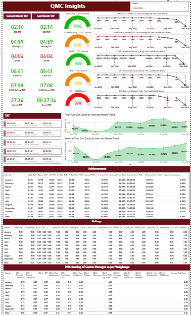

# 🏥 Stemz Healthcare — Employee TAT & Performance Ratings Dashboard

A Power BI performance-management dashboard built for **[Stemz Healthcare](https://in.linkedin.com/company/stemzhealthcare)**, a global healthcare group specializing in visa medical examinations and travel-health screening, with centres across India, Nepal, Bangladesh, Sri Lanka, the Philippines, Indonesia, and Tunisia.

The dashboard tracks **Turnaround Time (TAT)** and **staff performance ratings** across every clinical and front-office role involved in the visa medical examination journey — from applicant check-in to final report.

---

## 📌 Business Context

Applicants visiting a Stemz centre for a visa medical exam move through multiple touchpoints — front-desk registration, nursing, physician consultation, and radiology (X-ray). Management needed visibility into **how fast** each stage was completed (TAT) and **how well** each role was performing (quality ratings), both per-role and center-wide.

### Roles Covered
| Role | Notes |
|---|---|
| **GRO** (Guest/Front Office Executive) | Primary front-office role |
| **Nurse** | Clinical support |
| **Physician (GP)** | Doctor consultation |
| **Radiology (X-Ray)** | Imaging & referral cases |

A key nuance: employees from Nurse, Physician, and Radiology roles **also cover GRO duties** at times. So TAT and rating measures had to be built to correctly attribute performance to whichever role an employee was actually functioning in at that moment — not just their default designation.

---

## 🧩 The Data Challenge

- **Two disconnected data worlds:**
  - **HR data** (leave, attendance) — sourced from HR portals
  - **Transactional data** (patient visits, exam stages, timestamps) — sourced from **PostgreSQL**
- These two datasets had no common structure, so a **base table** was built to map employees and transactions together, with duplicates removed before joining.
- **ETL approach (Power Query):**
  - Merged multiple source tables into a unified structure
  - Applied transformations to trim data size and keep the model lean
  - Appended tables where role-specific transactional data needed to be stacked together
  - Added calculated columns to derive TAT (time-in-seconds between stage timestamps) ahead of DAX aggregation

---

## 📊 Key Measures (DAX)

The model contains 116 DAX measures. Most follow a repeatable pattern: calculate an average duration in seconds, then format it as `hh:mm:ss` for display. Grouped below by function.

### ⏱️ Turnaround Time (TAT) — by Role & Period
- `GRO TAT Current Month`, `GRO TAT Last Month`, `GRO TAT Last 3/6 Month`, `GRO TAT YTD`
- `GP TAT Current Month` / Last Month / Last 3/6 Month / YTD
- `X-RAY TAT Current Month` / Last Month / Last 3/6 Month / YTD (fresh cases)
- `X-RAY Referral TAT` — same period breakdown, for referred (repeat) cases
- `Autofit Certification TAT`, `GP_TAT1`, `X-RAY_TAT1`, `X-RAY_Ref TAT1` — point-in-time variants

### 🚶 First-Visit TAT — by Role
- `TAT_FIRST_VISIT_GRO`, `TAT_FIRST_VISIT_Nurse`, `TAT_FIRST_VISIT_GP`, `TAT_FIRST_VISIT_X-RAY`
- `AverageTAT_FIRST_VISIT` — filtered to zero-TAT-status "clean" first visits only
- `# of Normal_Applicant_Count`, `# of Referral_Applicant_Count` — distinct applicant counts by visit type

### ⭐ Quality & Performance Ratings (QWP Scores)
- `GRO_QWP_Ratings`, `GP_QWP1_Ratings`, `GP_QWP2_Ratings`, `X-RAY_QWP_Ratings` — each broken out for the 1st/2nd/3rd last month, to trend recent performance
- `Average of PMS Score for CM`, `YTD PMS Score`, `YTD_PMS_Score` — overall Performance Management Score

### 📈 Applicant Volume & Workload
- `1st_Visit_App_Seen_Last_Month` / `2nd_Last_Month` / `3rd_Last_Month`
- `YTD_Applicant`, `WorkDone_%age` (Last/2nd Last/3rd Last Month)

---

### 📸 Screenshots

**PMS for Core**

**PMS For CM**

**Center + Central**

**QMC**

---

## 🧠 What This Project Demonstrates

- Reconciling **multi-source data** (HR portals + PostgreSQL transactional data) into a single reporting model via a custom base/mapping table
- **Power Query ETL**: merging, appending, and transforming tables to keep the model lean while enriching it with TAT-ready columns
- Modeling **cross-functional role attribution** (an employee's role at time of transaction, not just their default title)
- Advanced **DAX time-intelligence**: rolling 1/3/6-month and YTD windows via `DATESINPERIOD`, plus converting raw seconds into readable `hh:mm:ss` durations
- Designing a **performance-ratings framework** (QWP scores, PMS scores, referral closure %) usable across four different operational roles

---

## 🚀 Tech Stack

- **Power BI Desktop** — modeling & visualization
- **Power Query (M)** — multi-source ETL: merge, append, transform
- **PostgreSQL** — transactional data source
- **DAX** — TAT, ratings, and time-intelligence measures

---

